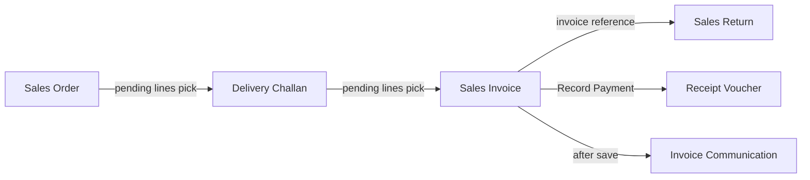

# Sales Module — WPF Analysis & React Migration Plan

**Status:** Analysis complete — **do not implement** until this document is reviewed and approved.  
**Scope:** UI migration + API integration only. **No backend or database changes** unless explicitly approved.  
**Date:** 2026-06-10

---

## 1. Executive summary

| Area | WPF | React (`ims-web`) | Gap |
|------|-----|-------------------|-----|
| Core transaction screens (SO, DC, SI, SR) | Full production | v1 scaffold + CRUD (~60–70% parity) | Consolidation workflows, master pickers, permissions |
| Quotation | **Not in WPF nav** | Full v1 module | N/A for WPF parity; web-only feature |
| Registers & MIS (4 registers + analysis) | Production | Generated XAML stubs only | UI + API wiring needed |
| Import sales invoice | Production | Stub shell | UI + `POST /api/import/sales-invoices` |
| Bill format / print templates | Production (API-driven) | Client-side print only | Template API not integrated |
| Invoice communication | Production modal | Not started | **No API** — WPF uses local coordinator |
| Sales/purchase settings | Settings panel | Not integrated | API exists (`/api/settings/sales-purchase`) |

**Conclusion:** The five React transaction modules share a solid platform (list → workspace → entry, repository pattern, GST math, print hooks). **WPF parity is blocked primarily by UI gaps**, not missing core CRUD APIs. Several WPF features depend on **existing but unused API endpoints** (document consolidation). A small set of WPF features have **no API** and must be reported before UI work (invoice communication channels, quotation→SO convert).

---

## 2. WPF Sales Module — complete inventory

### 2.1 Architecture pattern (all transaction modules)

```
Sidebar List (StandardListView)
    → Multi-tab Workspace (*WorkspaceView)
        → Entry Form (*EntryView)
            → Shared: SalesEntryFormViewModelBase / SalesDocumentEntryViewModelBase
```

- **Data layer:** `ImsApiClient` → REST (`IMS/Services/Api/ImsApiClient.cs`)
- **Print:** `SalesOrderPrintService`, `SalesBillFlowDocumentRenderer`, `BillFormatPrintResolver`
- **Security:** `MenuPermissionSession` (menu RBAC) + `EditDeleteGuard` (confirmation password)
- **GST:** `SalesLineItem` + `GstEntrySummarySupport` (intra CGST/SGST vs inter IGST)

### 2.2 Primary transaction modules

#### Sales Order (`sales-orders`)

| Category | Features |
|----------|----------|
| **Screens** | List → `SalesOrderWorkspaceView` → `SalesOrderEntryView` |
| **List** | Server paging (10–500), debounced search, status filter, column manager, sort all columns, export Excel/PDF, print list, row print |
| **Entry** | Multi-tab (+ New Bill), product picker, barcode scan, F11 Save+Next, F12 Print+Save+Next, F7 Cancel, prefix Tab/Enter for next number |
| **Header fields** | SO prefix/no/date, customer, salesman, payment terms, delivery priority, billing/shipping address, GST header row |
| **Validations** | Valid customer (not Walk In/Select), ≥1 line, qty>0, `EditDeleteGuard` on edit/delete |
| **Calculations** | Line: qty×rate−discount+GST; header gross/discount/sp.discount/add-other→net; GST summary by place of supply |
| **API** | `/api/sales-orders` (CRUD, stats, next-no, by-no, by-formatted, **pending-for-delivery**, **pending-delivery-lines**) |
| **Dependencies** | Accounts (customers), products, company GSTIN, bill formats |

**Key WPF files:** `ViewModels/Pages/SalesOrdersViewModel.cs`, `SubPages/SalesOrderWorkspaceViewModel.cs`, `AddSalesOrderViewModel.cs`, `Views/SalesOrderEntryView.xaml`, `Services/SalesOrderPickService.cs`

---

#### Delivery Challan (`delivery-challan`)

| Category | Features |
|----------|----------|
| **Screens** | List → `DeliveryChallanWorkspaceView` → `DeliveryChallanEntryView` |
| **List** | Same standard list features as SO family (search, filter, paging, export, print) |
| **Entry** | **Load from Sales Orders** (multi-pick pending SO lines), warehouse, vehicle, transporter, SO ref per line |
| **Validations** | Customer + lines; qty capped by `MaxDeliverQty` from SO pending |
| **Workflow** | Lines carry `SoPrefix`, `SoDocNo`, `SoFormattedDocNo`, `SoLineSr`, `SoPendingQty`; updates SO fulfillment on save |
| **API** | `/api/delivery-challans` + consolidation: `GET/POST /api/sales-orders/pending-for-delivery`, `pending-delivery-lines` |
| **Dependencies** | Sales orders, customers, products, warehouses |

**Key WPF files:** `DeliveryChallansViewModel.cs`, `AddDeliveryChallanViewModel.cs`, `SalesOrderPickService.cs`, `SalesOrderMultiPickWindow.xaml`

---

#### Sales Invoice (`sales-invoice`)

| Category | Features |
|----------|----------|
| **Screens** | List → `SalesInvoiceWorkspaceView` → `SalesInvoiceEntryView` |
| **List** | Standard list + export/print |
| **Entry** | **Load from Delivery Challans** (consolidation pick), payment type/mode, paid amount, balance due, due date, DC reference, GST header, **Record Payment** → Receipt Voucher |
| **Post-save** | `InvoiceCommunicationWindow` (email/SMS/WhatsApp prompt) |
| **Validations** | Customer + lines; payment rules (non-cash, balance>0); rate warnings via `SalesRateResolver` |
| **Calculations** | Full GST + round-off + payment status mapping on save |
| **API** | `/api/sales-invoices` + `GET/POST /api/delivery-challans/pending-for-invoice`, `pending-invoice-lines`; rate: `GET /api/purchase-invoices/latest-sales-rate/{code}`; settings: `/api/settings/sales-purchase` |
| **Dependencies** | Delivery challans, customers, products, receipt vouchers, communication settings, bill formats |

**Key WPF files:** `SalesInvoicesViewModel.cs`, `AddSalesInvoiceViewModel.cs`, `DocumentConsolidationPickService.cs`, `SalesRateResolver.cs`, `InvoiceCommunicationCoordinator.cs`, `SalesInvoiceLineItemsPanel.xaml`

---

#### Sales Return (`sales-return`)

| Category | Features |
|----------|----------|
| **Screens** | List → `SalesReturnWorkspaceView` → `SalesReturnEntryView` |
| **List** | Standard list features |
| **Entry** | Return date, invoice reference, return reason, QC remark, return warehouse |
| **Validations** | Customer + lines (base document rules) |
| **API** | `/api/sales-returns` (numbered-doc CRUD, stock in) |
| **Dependencies** | Customers, products, warehouses, sales invoices (reference) |

**Key WPF files:** `SalesReturnsViewModel.cs`, `AddSalesReturnViewModel.cs`, `SalesReturnEntryView.xaml`

---

#### Quotation — **not in WPF navigation**

- Exists only in **React** (`ims-web/src/quotation/`) and **API** (`/api/quotations`).
- WPF references `CommunicationDocumentKind.Quotation` enum only.
- **Out of WPF parity scope** unless product owner adds Quotation to WPF baseline.

---

### 2.3 Related sales screens (WPF production)

| Screen | Nav path | Features | API |
|--------|----------|----------|-----|
| Sales Analysis Report | MIS Reports → Sales Analysis | Product/customer/group/date filters, totals, print | `GET /api/reports/sales-analysis` |
| SO Register | Registers → Sales Order Register | Date range, bill no, show, print | `GET /api/reports/document-register?type=sales_order` |
| DC Register | Registers → Sales D.C. Register | Same | `type=delivery_challan` |
| Invoice Register | Registers → Sales Invoice Register | Same | `type=sales_invoice` |
| Return Register | Registers → Sales Return Register | Same | `type=sales_return` |
| Import Sales Invoice | Import → Sales Invoice | Excel template download/upload | `POST /api/import/sales-invoices` |
| Bill Format Master | IT Security → Bill Format Master | Layout designer per doc type | `/api/sales-bill-templates`, `/api/bill-formats` |
| Sales/Purchase config | Settings panel | Rate source: Product Master vs Purchase Invoice | `GET/PUT /api/settings/sales-purchase` |

---

### 2.4 Shared WPF infrastructure

| Component | Path | Purpose |
|-----------|------|---------|
| Entry base | `SalesEntryFormViewModelBase.cs` | Lines, totals, GST, scan, save/print |
| Document base | `SalesDocumentEntryViewModelBase.cs` | Numbered docs, API CRUD, customer validation |
| Workspace base | `SalesEntryWorkspaceViewModelBase.cs` | Tab lifecycle |
| List base | `SalesDocumentListViewModelBase.cs` | API paging for DC/INV/SR |
| Line model | `Models/SalesLineItem.cs` | Tax math |
| GST summary | `GstEntrySummarySupport.cs` | Header aggregation |
| Permissions | `MenuPermissionSession.cs`, `EditDeleteGuard.cs` | RBAC + edit/delete password |
| API client | `Services/Api/ImsApiClient.cs` | All HTTP calls |
| DTO mapping | `Services/Api/ApiDocumentMapper.cs` | API ↔ VM |

### 2.5 Document workflow chain



### 2.6 GST calculation (must match exactly)

```
Line:
  lineGross = qty × rate
  discVal = discValue OR lineGross × discPercent / 100
  taxable = max(0, lineGross − discVal)
  tax = taxable × taxPercent / 100
  amount = taxable + tax
  CGST/SGST = tax/2 (intra-state)
  IGST = tax (inter-state)

Header:
  gross = Σ line.amount
  net = gross − discount − spDiscount + addOther
  inter-state when placeOfSupply ≠ company state
```

---

## 3. React current state (`ims-web`)

### 3.1 Production modules (override WPF stubs via `refinedScreenMap.tsx`)

| Module | List | Workspace | Entry | Repository |
|--------|------|-----------|-------|------------|
| Sales Order | `sales-order/SalesOrderListScreen.tsx` | `SalesOrderWorkspaceScreen.tsx` | `SalesOrderEntryForm.tsx` | `/api/sales-orders` |
| Quotation | `quotation/QuotationListScreen.tsx` | `QuotationWorkspaceScreen.tsx` | `QuotationEntryForm.tsx` | `/api/quotations` |
| Sales Invoice | `sales-invoice/SalesInvoiceListScreen.tsx` | `SalesInvoiceWorkspaceScreen.tsx` | `SalesInvoiceEntryForm.tsx` | `/api/sales-invoices` |
| Delivery Challan | `delivery-challan/DeliveryChallanListScreen.tsx` | `DeliveryChallanWorkspaceScreen.tsx` | `DeliveryChallanEntryForm.tsx` | `/api/delivery-challans` |
| Sales Return | `sales-return/SalesReturnListScreen.tsx` | `SalesReturnWorkspaceScreen.tsx` | `SalesReturnEntryForm.tsx` | `/api/sales-returns` |

### 3.2 Shared platform (reused — do not reimplement)

- `sales-invoice.scss` — transaction layout + responsive breakpoints
- `CorporateDataGrid` — list + line grids
- `*WorkspaceProvider.tsx` + `useWorkspaceListIntent` — tabs, dirty state, nav intent
- `repository/*` — HTTP probe + local fallback
- `calculations.ts`, `gstTax.ts` — GST math
- `document/*` — print mappers + `DocumentPrintService`
- `transactionListCrud.tsx` — list New/Edit/Delete
- Keyboard: `useDocumentShortcuts`, `useWorkspaceTabShortcuts`

### 3.3 What React implements today

| Feature | Status |
|---------|--------|
| List grid with search + status filter | ✅ All 5 modules |
| List New / Edit / Delete | ✅ All 5 (toolbar + row actions) |
| Multi-tab workspace | ✅ All 5 |
| Save create/update via API `_id` | ✅ All 5 |
| peekNextNo / new bill numbering | ✅ All 5 |
| Client GST + line validations | ✅ All 5 |
| Print + F11/F12 shortcuts | ✅ All 5 (client print service) |
| HTTP + local repository fallback | ✅ All 5 |
| Responsive layout | ✅ (WPF enhancement, not regression) |

### 3.4 What React does NOT implement (WPF gaps)

| Feature | WPF | React | API available? |
|---------|-----|-------|----------------|
| Server-side paging/sort/column filters on list | ✅ | ❌ (hard limit ~100) | ✅ query params on list routes |
| Column manager / saved columns | ✅ | ❌ placeholder (SI) | ✅ `/api/grid-columns/:moduleKey` |
| Customer picker (accounts API) | ✅ | ❌ `SAMPLE_CUSTOMERS` mock | ✅ `GET /api/accounts?type=customer` |
| Product picker / browse | ✅ | ❌ mock scan line | ✅ `GET /api/products`, lookup |
| Load pending SO → DC lines | ✅ | ❌ | ✅ `pending-for-delivery`, `pending-delivery-lines` |
| Load pending DC → invoice lines | ✅ | ❌ | ✅ `pending-for-invoice`, `pending-invoice-lines` |
| Line-level SO/DC cross-refs on save | ✅ | ❌ mappers exist, UI doesn't populate | ✅ server hooks enforce |
| SO fulfillment status UI | ✅ | ❌ | ✅ status on SO model |
| Sales rate resolver warnings | ✅ | ❌ | ✅ `latest-sales-rate/{code}` |
| Record payment → receipt voucher | ✅ | ❌ | ✅ receipt voucher routes exist |
| Invoice communication modal | ✅ | ❌ | ⚠️ **No dedicated API** |
| Bill format from API | ✅ | ❌ client HTML print | ✅ `/api/sales-bill-templates` |
| List export Excel/PDF | ✅ | Partial / stub | N/A (client-side) |
| Menu permissions (CanAdd/Edit/Delete) | ✅ | ❌ | ✅ menus/roles API exists |
| Edit/delete confirmation password | ✅ | ❌ | ✅ security policy API |
| Document registers (×4) | ✅ | Stub XAML shell | ✅ `document-register` |
| Sales analysis report | ✅ | Stub XAML shell | ✅ `sales-analysis` |
| Import sales invoice | ✅ | Stub XAML shell | ✅ `POST /api/import/sales-invoices` |
| Sales/purchase settings panel | ✅ | Not wired | ✅ `settings/sales-purchase` |
| Quotation → SO convert | — | ❌ | ⚠️ **No convert endpoint** |

---

## 4. API inventory (read-only — no changes proposed)

All routes already exist in `api/src`. React sales modules use a **subset**.

### 4.1 Core document routes

| Module | Base path | React uses | React does NOT use |
|--------|-----------|------------|-------------------|
| Sales Order | `/api/sales-orders` | CRUD by `_id`, stats, next-no, by-formatted | by-no, pending-for-delivery, pending-delivery-lines |
| Delivery Challan | `/api/delivery-challans` | CRUD by `_id`, stats, next-no | pending-for-invoice, pending-invoice-lines |
| Sales Invoice | `/api/sales-invoices` | CRUD by `_id`, stats, next-no | by-no routes |
| Sales Return | `/api/sales-returns` | CRUD by `_id`, stats, next-no | by-no routes |
| Quotation | `/api/quotations` | Full CRUD subset | by-no routes |

### 4.2 Supporting routes (sales-related)

| Route | Purpose | Wired in React sales UI? |
|-------|---------|--------------------------|
| `GET /api/accounts` | Customer picker | ❌ |
| `GET /api/products`, `/lookup` | Product picker | ❌ |
| `GET /api/grid-columns/:key` | List column prefs | ❌ |
| `GET/PUT /api/settings/sales-purchase` | Rate source setting | ❌ |
| `GET /api/sales-bill-templates` | Print layouts | ❌ |
| `GET /api/bill-formats` | Bill format master | ❌ |
| `GET /api/reports/document-register` | Registers | ❌ |
| `GET /api/reports/sales-analysis` | MIS report | ❌ |
| `POST /api/import/sales-invoices` | Excel import | ❌ |
| Security edit/delete policy | Confirmation password | ❌ |

---

## 5. Missing APIs / dependencies (report before implementation)

These WPF behaviors **cannot be fully replicated in React UI alone**. Report to stakeholders; **do not change backend** without approval.

| # | WPF feature | Gap type | Notes |
|---|-------------|----------|-------|
| 1 | Invoice communication (email/SMS/WhatsApp after SI save) | **No API** | WPF uses `InvoiceCommunicationCoordinator` + settings; needs product decision: stub modal vs new API |
| 2 | Quotation → Sales Order conversion | **No API** | No convert endpoint; could be UI-only "copy to new SO" client-side |
| 3 | Sales Return pull from invoice lines | **No API** | WPF uses manual reference; no `pending-for-return` endpoint |
| 4 | Native PDF generation | Client gap | WPF `SalesBillPdfExporter`; React uses browser print — parity is visual not file format |
| 5 | Auth on document CRUD routes | **Policy gap** | Document routes are open; settings/templates require auth — align with ops/security policy in UI only |

**All other major gaps have existing APIs** — implementation is UI wiring only.

---

## 6. Migration phases (implementation order — after approval)

### Phase 0 — Prerequisites (no backend changes)

- [ ] API + MongoDB running locally (see `api/README` / `npm run mongo:dev`)
- [ ] Vite proxy for `/api` (already configured)
- [ ] Sign-off on this analysis document

### Phase 1 — Core parity (transaction modules)

Priority: features that block daily operations.

| # | Task | Modules | API used |
|---|------|---------|----------|
| 1.1 | Customer picker (`AccountMaster` combobox → API) | All 5 | `GET /api/accounts/names` ✅ Done |
| 1.2 | Product picker + barcode scan | All 5 | `GET /api/products` |
| 1.3 | Server list paging + sort + filters | All 5 | List query params |
| 1.4 | Column manager | All 5 | `/api/grid-columns` |
| 1.5 | SO → DC consolidation picker | DC | `pending-for-delivery` |
| 1.6 | DC → SI consolidation picker | SI | `pending-for-invoice` |
| 1.7 | Line cross-ref fields on save (mappers already partial) | DC, SI | Existing POST/PUT |
| 1.8 | Sales rate resolver warnings | SI | `latest-sales-rate` |
| 1.9 | Payment fields + balance display | SI | Existing invoice fields |
| 1.10 | Permissions + edit/delete guard UI | All 5 | menus + security API |

### Phase 2 — Workflow & print parity

| # | Task | API |
|---|------|-----|
| 2.1 | Record payment → navigate to receipt voucher with seed | receipt voucher routes |
| 2.2 | Bill template print integration | `/api/sales-bill-templates` |
| 2.3 | List export (Excel/CSV client-side) | N/A |
| 2.4 | Invoice communication modal (stub or approved API) | TBD |

### Phase 3 — Registers, reports, import

| # | Task | API |
|---|------|-----|
| 3.1 | Document register screens (×4) | `document-register` |
| 3.2 | Sales analysis report | `sales-analysis` |
| 3.3 | Import sales invoice page | `import/sales-invoices` |
| 3.4 | Sales/purchase settings panel | `settings/sales-purchase` |

### Phase 4 — Verification matrix

Per module, verify each row against WPF:

- [ ] List: search, filter, paging, sort, columns, export, print, permissions
- [ ] New: next number, defaults, tab focus
- [ ] Edit: load by id, dirty detection, discard prompt
- [ ] Save: validations, API payload, stock side-effects
- [ ] Delete: confirm, guard password, list refresh
- [ ] Print: layout, GST breakdown, company header
- [ ] Shortcuts: F11, F12, F7, Ctrl+T, Esc
- [ ] Consolidation workflows (SO→DC→SI)
- [ ] Responsive layout (no broken fields at 1100px / 640px)

---

## 7. Reusable React component map

| WPF concept | React component / module |
|-------------|------------------------|
| `StandardListView` | `*ListScreen` + `CorporateDataGrid` + `transactionListCrud` |
| `*WorkspaceView` | `*WorkspaceScreen` + `*WorkspaceProvider` |
| `*EntryView` | `*EntryForm` + `use*Document` |
| `SalesInvoiceLineItemsPanel` | Shared line grid in entry forms |
| `TransactionSalesGstHeaderRow` | GST fields in header section |
| `SalesOrderMultiPickWindow` | **New:** `ConsolidationPickDialog` (Phase 1.5/1.6) |
| `ProductBrowseWindow` | **New:** `ProductPickDialog` (Phase 1.2) |
| `MasterPickWindow` | **New:** `AccountPickCombobox` (Phase 1.1) |
| `InvoiceCommunicationWindow` | **New:** `InvoiceCommunicationDialog` (Phase 2.4) |
| `EditDeleteGuard` | **New:** `useEditDeleteGuard` hook (Phase 1.10) |

---

## 8. Risk register

| Risk | Mitigation |
|------|------------|
| Consolidation UI wrong → API rejects save | Use existing `pending-*` endpoints; mirror WPF pick flow |
| GST mismatch | Single `calculations.ts`; cross-check with `docs/SALES-INVOICE-GST.md` |
| Permissions not enforced in React | Wire `MenuPermissionSession` equivalent before production |
| Local fallback masks API errors | Show connection status on list toolbar |
| Quotation scope confusion | Treat as web-only; exclude from WPF sign-off unless requested |

---

## 9. References

| Document | Content |
|----------|---------|
| `docs/TRANSACTION-MIGRATION-ROADMAP.md` | Platform + clone sequence |
| `docs/SALES-INVOICE-PARITY.md` | SI detailed parity |
| `docs/SALES-ORDER-CLONE-REPORT.md` | SO clone report |
| `docs/QUOTATION-CLONE-REPORT.md` | Quotation (web-only) |
| `docs/database/document-consolidation.md` | SO→DC→SI server behavior |
| `docs/WPF-REACT-WORKFLOW-VALIDATION.md` | QA checklist |

---

## 10. Approval checklist

Before any implementation PR:

- [ ] Stakeholder confirms WPF baseline (Quotation in/out of scope)
- [ ] Missing API items (#5) reviewed — invoice communication decision
- [ ] Phase 1 task list prioritized
- [ ] No backend/database change requests filed without explicit approval
- [ ] Feature verification matrix owner assigned

**Next step after approval:** Begin Phase 1.1 (customer picker) — UI only, `GET /api/accounts`.
