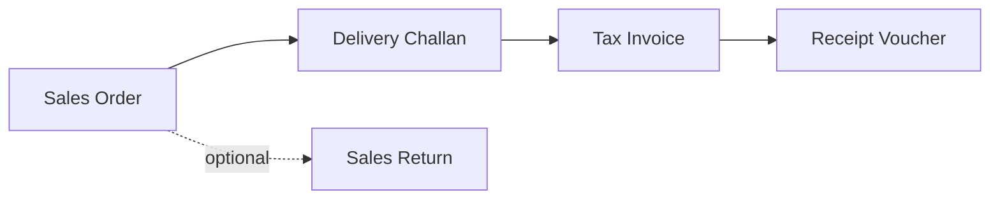
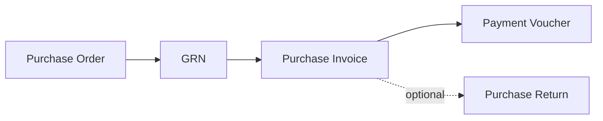
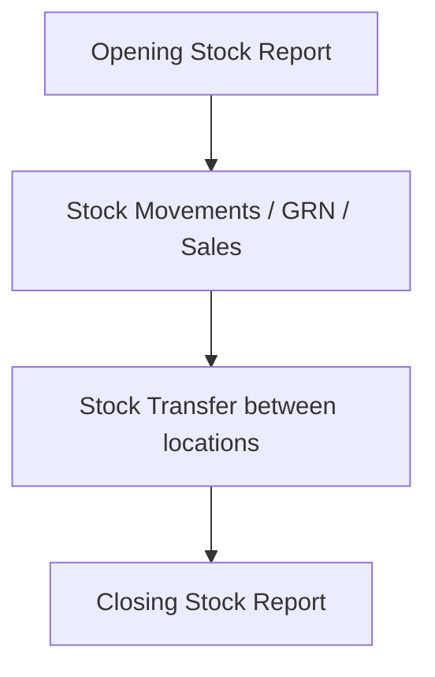

# IMS — Inventory Management System  
## Sales Team Product Guide

**Document version:** 1.0  
**Last updated:** May 2026  
**Audience:** Sales, pre-sales, and client-facing teams  
**Classification:** Client-ready (non-technical)

---

> **How to use this document**  
> Use this guide for client demos, discovery calls, proposals, and follow-ups. Replace bracketed placeholders (e.g. `[Insert screenshot]`) with your branded screenshots before exporting to PDF, Word, or PowerPoint.

---

## Table of Contents

1. [Product Overview](#1-product-overview)  
2. [Key Features & Modules](#2-key-features--modules)  
3. [Business Benefits](#3-business-benefits)  
4. [User Flow / Process Flow](#4-user-flow--process-flow)  
5. [Dashboard & Important Screenshots](#5-dashboard--important-screenshots)  
6. [Unique Selling Points (USP)](#6-unique-selling-points-usp)  
7. [Client Use Cases](#7-client-use-cases)  
8. [FAQ Section](#8-faq-section)  
9. [Optional Pricing / Plan Section](#9-optional-pricing--plan-section)  
10. [Conclusion](#10-conclusion)

---

## 1. Product Overview

### What is IMS?

**IMS (Inventory Management System)** is an integrated business application that helps trading, manufacturing, and distribution companies manage **inventory, sales, purchases, production, and finance** from one place.

Instead of juggling spreadsheets, separate billing tools, and disconnected stock registers, IMS gives your team a **single source of truth** for:

- What you sell and buy  
- How much stock you have (and where)  
- Who owes you money—and whom you owe  
- How production and fulfillment are progressing  

### Who is it for?

| Business type | Typical fit |
|---------------|-------------|
| **Traders & distributors** | Sales orders, delivery challans, tax invoices, stock transfers |
| **Manufacturers** | Raw material → WIP → finished goods, work orders, purchase & GRN |
| **Multi-location businesses** | Godown/warehouse transfers, opening & closing stock reports |
| **Finance-conscious owners** | Receivables, payables, vouchers, trial balance, profit analysis |

### How do users access it?

- **Desktop application** (Windows) — fast, familiar for office and counter staff  
- **Secure login** — each user signs in with their own credentials  
- **Live data** — connected to a central database so everyone sees up-to-date figures  

### One-line pitch

> *“IMS connects your sales desk, warehouse, purchase team, and accounts office—so you always know stock, billing, and cash position without chasing files.”*

---

## 2. Key Features & Modules

IMS is organized into clear menu sections. Below is what you can confidently present to clients.

### 2.1 Dashboard (Executive Overview)

- **Today’s sales**, total sales, total purchase, income vs expenses  
- **Inventory value** and open work orders at a glance  
- **Three visual panels:**  
  - *Accounting Overview* — sales vs purchase trends  
  - *Inventory Management* — stock by type (Raw, WIP, Finished, low-stock alerts)  
  - *Production Status* — orders, progress, completion, delays  
- **Quick links** to common tasks (invoice, purchase, stock transfer, reports)  
- **Refresh** for live figures from the server  

### 2.2 Sales

| Module | What it does |
|--------|----------------|
| **Sales Order** | Capture customer orders before dispatch or billing |
| **Delivery Challan (D.C.)** | Record goods sent to customer (dispatch proof) |
| **Tax Invoice / Sales Invoice** | Bill customers; track posted, draft, paid status |
| **Sales Return** | Handle returns and linked credit adjustments |

**Sales highlights for demos:** List with search and pagination (handles large volumes), print preview, edit from list, status badges (Open, Posted, Paid, etc.).

### 2.3 Purchase

| Module | What it does |
|--------|----------------|
| **Purchase Order** | Order materials from suppliers |
| **Goods Receipt Note (GRN)** | Record goods received against PO or direct receipt |
| **Purchase Invoice** | Supplier bills and payables |
| **Purchase Return** | Return goods to supplier |

**Purchase highlights:** Same familiar layout as sales—easy training for teams who already know one side of the business.

### 2.4 Inventory & Warehouse

| Module | What it does |
|--------|----------------|
| **Stock Movements** | Log receipts, issues, and adjustments |
| **Stock Transfer** | Move stock between godowns / warehouses |

**Inventory reports (separate menu):**

- Opening Stock Report  
- Closing Stock Report  
- Stock Detailed Summary  

### 2.5 Production

| Module | What it does |
|--------|----------------|
| **Work Order** | Manufacturing orders tied to demand and BOM |
| **Production Status** | Track progress and completion |
| **Work Centers** | Capacity and routing setup |

### 2.6 Finance & Accounts

| Module | What it does |
|--------|----------------|
| **Payment Voucher** | Record payments to parties |
| **Receipt Voucher** | Record money received |
| **Debit Note / Credit Note** | Adjustments with parties |
| **Bank Entry** | Deposits, withdrawals, bank transactions |
| **Petty Cash / Cash Expense** | Small cash expenses and reimbursements |

### 2.7 Receivables & Reports

- **Outstanding Report** — who owes you / whom you owe  
- **Due Report (Day-wise)** — aging by days  
- **Due Report (Amount-wise)** — aging by amount slabs  

### 2.8 MIS & Financial Statements

**Management reports:** Ledger, reorder level, profit analysis, purchase analysis, sales analysis, production report, day-end posting, petty cash report.

**Financial statements:** Trial balance, trading account, profit & loss, balance sheet, income vs expense view.

**Day books:** Day book, cash book, bank book.

### 2.9 Administration (Master Data)

| Master | Purpose |
|--------|---------|
| **Product Master** | Items you buy, make, and sell |
| **Product Types, Main Groups, Sub Groups** | Classification for reporting |
| **Sale UOM / Purchase UOM** | Units of measure |
| **Account Master** | Customers, suppliers, ledgers |
| **Company Registration** | Business name, GSTIN, bank details for invoices |
| **Customer Types** | Segment customers for analysis |
| **User Management** | Users, roles, departments |
| **Settings** | Themes and preferences |

### 2.10 Data Import (Excel)

Bulk upload via Excel templates for:

- Products  
- Accounts (customers & suppliers)  
- Sales invoices (with line items)  
- Purchase invoices (with line items)  

*Ideal for go-live migrations and large onboarding.*

---

## 3. Business Benefits

### For business owners & directors

| Benefit | What it means in practice |
|---------|---------------------------|
| **Visibility** | Dashboard shows sales, purchase, stock value, and cash indicators without waiting for month-end |
| **Control** | Fewer stock surprises—low-stock and reorder reports highlight risk early |
| **Faster decisions** | Drill from summary KPIs to lists and documents in the same system |
| **Audit trail** | Documents (SO → DC → Invoice, PO → GRN → PI) follow a logical chain |

### For operations & warehouse

| Benefit | What it means in practice |
|---------|---------------------------|
| **Accurate stock** | Transfers and movements recorded in system, not only on paper |
| **Less double entry** | Sales and purchase documents drive stock and accounts together |
| **Scalable lists** | Pagination handles thousands of records without slowing daily work |

### For sales & purchase teams

| Benefit | What it means in practice |
|---------|---------------------------|
| **Faster billing** | Create invoice from order/challan context; print professional documents |
| **Clear status** | Open, posted, paid, cancelled—everyone sees the same status |
| **Customer history** | Account master links parties across orders and invoices |

### For accounts & finance

| Benefit | What it means in practice |
|---------|---------------------------|
| **Receivables focus** | Outstanding and due reports support collection calls |
| **Voucher discipline** | Payments and receipts recorded with references |
| **Reporting pack** | Trial balance, P&L, and analysis reports in one product |

### ROI talking points (use with care—customize per client)

- Reduce time spent reconciling Excel stock vs billing (**hours per week**)  
- Cut billing errors from manual copy-paste between systems  
- Improve collection with visible outstanding and due aging  
- Onboard faster with Excel import instead of manual master entry  

---

## 4. User Flow / Process Flow

### 4.1 Typical day for a user

```
Login → Dashboard (review KPIs) → Open module (e.g. Sales Invoice) 
→ Create or edit document → Save/Post → Print if needed → Back to list or Dashboard
```

### 4.2 Sales cycle (recommended story for demos)



| Step | Document | Client benefit |
|------|----------|----------------|
| 1 | **Sales Order** | Confirms customer commitment and quantity |
| 2 | **Delivery Challan** | Proof of dispatch before invoice |
| 3 | **Tax Invoice** | Legal billing and revenue recognition |
| 4 | **Receipt Voucher** | Payment recorded against invoice |
| Optional | **Sales Return** | Handles damaged/returned goods cleanly |

### 4.3 Purchase cycle



### 4.4 Inventory cycle



### 4.5 New client onboarding (implementation flow)

| Phase | Activities |
|-------|------------|
| **Week 1** | Company registration, users, product & account masters (or Excel import) |
| **Week 2** | Opening stock, trial transactions, train sales & purchase |
| **Week 3** | Go-live on invoices; parallel run with old system if needed |
| **Week 4** | Reports, receivables, fine-tune masters and permissions |

---

## 5. Dashboard & Important Screenshots

*Insert branded screenshots below before client meetings. Suggested capture: 1920×1080, light theme, sample data anonymized.*

### 5.1 Login screen

**Purpose:** Secure access; supports role-based usage.

`[Insert screenshot: Login screen — username and password]`

---

### 5.2 Main dashboard

**Purpose:** Executive snapshot—sales, purchase, inventory value, work orders.

**Callouts to mention:**
- Top KPI cards (Today’s Sales, Total Sales, Total Purchase, Income vs Expenses, Inventory Value, Work Orders)  
- Accounting Overview chart (Sales vs Purchase by month)  
- Inventory Management chart (stock by type with hover values)  
- Production Status donut (stock by category)  

`[Insert screenshot: Full dashboard view]`

`[Insert screenshot: Dashboard — Inventory Management panel close-up]`

---

### 5.3 Sales Invoice list

**Purpose:** High-volume list with pagination, status, actions (edit, print, delete).

`[Insert screenshot: Sales Invoice list with pagination bar]`

---

### 5.4 Sales Invoice entry

**Purpose:** Header (customer, dates, GST), line items, totals, save/print.

`[Insert screenshot: Sales Invoice entry form with line items]`

`[Insert screenshot: Print preview — Tax Invoice]`

---

### 5.5 Purchase Order / GRN

`[Insert screenshot: Purchase Order list]`

`[Insert screenshot: GRN entry screen]`

---

### 5.6 Stock Transfer

`[Insert screenshot: Stock Transfer list and entry]`

---

### 5.7 Product Master

`[Insert screenshot: Product Master list]`

`[Insert screenshot: Add/Edit Product form]`

---

### 5.8 Outstanding / Due reports

`[Insert screenshot: Outstanding Report]`

`[Insert screenshot: Due Report — Day-wise]`

---

### 5.9 Excel import

`[Insert screenshot: Import module — download template and upload]`

---

### 5.10 Settings & company profile

`[Insert screenshot: Company Registration — GSTIN, bank details]`

`[Insert screenshot: User Management]`

---

## 6. Unique Selling Points (USP)

Use these differentiators when comparing to spreadsheets, generic ERPs, or disconnected tools.

| # | USP | How to say it to the client |
|---|-----|------------------------------|
| 1 | **All-in-one for trading + manufacturing** | Sales, purchase, stock, production, and finance in one desktop app—not five different tools |
| 2 | **Document chain that matches Indian business practice** | SO → DC → Invoice and PO → GRN → Purchase Invoice—familiar flow for your team |
| 3 | **Built for volume** | Lists support large data (e.g. 10,000+ records) with fast paging—not a spreadsheet that breaks |
| 4 | **Live dashboard** | Owners see today’s sales, stock value, and alerts without exporting to Excel |
| 5 | **Excel import for go-live** | Migrate products, accounts, and invoices quickly |
| 6 | **Print-ready documents** | Invoices and orders print from the system for customer and audit use |
| 7 | **GST-ready company profile** | GSTIN, bank details, and terms on registered company master |
| 8 | **Receivables discipline** | Outstanding and due reports built for collection workflows |
| 9 | **Inventory intelligence** | Raw / WIP / Finished breakdown and low-stock visibility on dashboard |
| 10 | **Desktop performance** | Fast UI for daily operators; works on standard Windows PCs |

### Competitive positioning (internal use)

- **vs. Excel only:** Control, multi-user, audit trail, less formula risk  
- **vs. heavy ERP:** Faster to learn, focused on inventory + trading workflows, lower TCO story (customize)  
- **vs. billing-only software:** Stock and purchase integrated—not billing in isolation  

---

## 7. Client Use Cases

### Use case 1 — Distributor (FMCG / industrial goods)

**Profile:** 3 godowns, 50+ salesmen, 2,000+ SKUs  

**Pain:** Stock mismatch between godowns and billing; delayed outstanding follow-up  

**IMS solution:** Sales Order → DC → Invoice; Stock Transfer between godowns; Outstanding and Due reports  

**Outcome to claim:** Single stock truth; faster billing; improved collection visibility  

---

### Use case 2 — Manufacturer (components / assemblies)

**Profile:** Raw material purchase, in-house production, finished goods sale  

**Pain:** No clear WIP visibility; purchase and production not linked to sales  

**IMS solution:** PO → GRN; Work Orders; dashboard Raw/WIP/Finished; Sales Invoice for finished goods  

**Outcome to claim:** Better production planning input; reduced excess raw stock  

---

### Use case 3 — Trader with import / bulk purchase

**Profile:** High purchase volume, container-based buying, domestic resale  

**Pain:** Slow master setup; invoice data entry from supplier PDFs  

**IMS solution:** Excel import for products and purchase invoices; Purchase Analysis report  

**Outcome to claim:** Shorter go-live; less manual entry  

---

### Use case 4 — Multi-branch retail + wholesale

**Profile:** Retail counter + wholesale invoices; one central accounts team  

**Pain:** Finance needs consolidated receivables across branches  

**IMS solution:** Account Master; Receipt/Payment vouchers; Outstanding Report; Trial Balance  

**Outcome to claim:** Central finance view; consistent party ledger  

---

### Use case 5 — Growing SME replacing legacy software

**Profile:** 10–30 users; outgrowing old DOS/legacy system  

**Pain:** Training fear; need parallel run  

**IMS solution:** Familiar document names; Excel import; phased module rollout (Sales first, then Purchase, then Finance)  

**Outcome to claim:** Modern UI with lower disruption than full ERP replacement  

---

## 8. FAQ Section

### General

**Q: Is IMS cloud-based or on-premise?**  
A: IMS runs as a **desktop application** on Windows PCs, connected to a **central database server** on your network (or hosted VM). Your IT team or our implementation partner sets up the server; users install the desktop app. *Clarify your deployment model with delivery team before promising cloud/SaaS.*

**Q: How many users can work at the same time?**  
A: Multiple users can work concurrently when connected to the same central database. User accounts are managed in **User Management**.

**Q: Do we need internet?**  
A: Users need network access to the **application server** on your LAN/VPN. Internet is required only if the server is hosted in the cloud.

---

### Sales & purchase

**Q: Can we print tax invoices?**  
A: Yes. Sales and purchase documents support **print preview** for professional output (company logo/text from Company Registration).

**Q: Can we handle sales returns?**  
A: Yes, via the **Sales Return** module, aligned with your sales invoice workflow.

**Q: Does it support delivery challan before invoice?**  
A: Yes. **Delivery Challan** is a standard module in the sales flow.

---

### Inventory

**Q: Can we track stock in multiple warehouses/godowns?**  
A: Yes, using **Stock Transfer** and inventory reports (opening/closing stock).

**Q: Will the system warn us about low stock?**  
A: The dashboard highlights **low-stock** items, and the **Reorder Level Report** lists items at or below reorder quantity.

---

### Finance & reports

**Q: Can we see who has not paid?**  
A: Yes. Use **Outstanding Report** and **Due reports** (day-wise and amount-wise).

**Q: Do you provide profit and trial balance reports?**  
A: Yes, under **MIS Reports** and **Financial Statements** (e.g. Trial Balance, Profit & Loss).

---

### Implementation

**Q: Can we import our existing product and customer list?**  
A: Yes, via **Excel import** for products, accounts, and invoices (templates provided in the app).

**Q: How long does implementation take?**  
A: Typical range: **2–6 weeks** depending on data quality, user count, and modules enabled. Use the onboarding flow in Section 4.5 as a guide.

**Q: Do you provide training?**  
A: *[Insert your company training offer—e.g. on-site, remote, train-the-trainer.]*

---

### Security & support

**Q: Is login secure?**  
A: Users sign in with individual credentials. *[Confirm password policy, roles, and backup practices with your technical team.]*

**Q: What support do we get after go-live?**  
A: *[Insert SLA: phone/email, hours, AMC, optional annual contract.]*

---

## 9. Optional Pricing / Plan Section

*Customize this section with your commercial model. Remove or rename tiers as needed.*

### Suggested packaging framework

| Plan | Best for | Typical includes |
|------|----------|------------------|
| **Starter** | Single location, &lt; 10 users | Core Sales + Purchase + Product Master + Dashboard |
| **Professional** | Growing SME, multi-godown | Starter + Inventory + Finance vouchers + key reports |
| **Enterprise** | Manufacturing + multi-branch | Full modules + import + implementation + training days |
| **AMC / Support** | All clients | Updates, backup guidance, priority support *(annual)* |

### Pricing variables (internal checklist)

- Number of **users** (named or concurrent)  
- Number of **companies** / branches  
- **Modules** enabled  
- **Implementation** days (data migration, training)  
- **Customization** (if any)  
- **Hardware/server** (client-provided vs bundled)  

### Sample pricing table (placeholder)

| Item | Unit | Price (INR) |
|------|------|-------------|
| IMS Professional — per user / year | User | `[₹ ______]` |
| One-time implementation | Project | `[₹ ______]` |
| Data migration (Excel import support) | Lump sum | `[₹ ______]` |
| Training (per day) | Day | `[₹ ______]` |
| Annual maintenance (AMC) | % of license or fixed | `[₹ ______]` |

**Notes for sales:**
- Lead with **value and modules**, not feature dumps  
- Offer **phased rollout** to reduce upfront cost  
- Bundle **Year 1 implementation + AMC** for better close rates  

---

## 10. Conclusion

**IMS** gives trading, manufacturing, and distribution businesses a **practical, integrated way** to run sales, purchases, inventory, production, and finance—without the complexity of a generic enterprise ERP.

For your next client conversation, remember the three pillars:

1. **Operate** — SO → DC → Invoice and PO → GRN → Purchase Invoice with real stock impact  
2. **Control** — Dashboard, low stock, outstanding, and management reports  
3. **Grow** — Excel import, scalable lists, and a path from Starter to full Enterprise  

### Recommended demo flow (30 minutes)

| Time | Topic |
|------|--------|
| 5 min | Dashboard KPIs and three panels |
| 10 min | Sales Order → Invoice → Print |
| 5 min | Purchase GRN or PO (brief) |
| 5 min | Stock Transfer or Outstanding Report |
| 5 min | Product Master + Import + Q&A |

### Next steps for the prospect

1. Discovery call (users, locations, current software)  
2. Customized demo on **their** industry scenario  
3. Implementation plan + commercial proposal  
4. Pilot or phased go-live agreement  

---

### Document control

| Field | Value |
|-------|--------|
| Prepared for | Sales & Business Development |
| Product | IMS — Inventory Management System |
| Contact | `[Your company name, phone, email, website]` |
| Logo | `[Insert company logo on cover when exporting]` |

---

*End of document*
